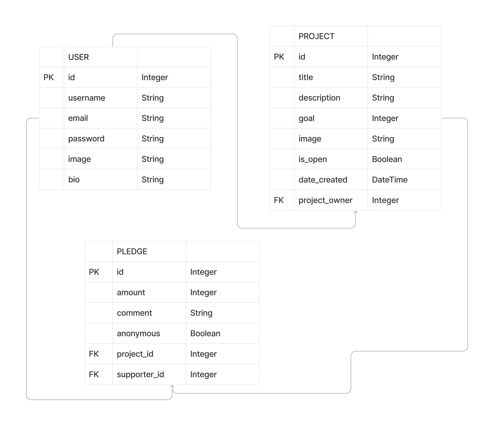
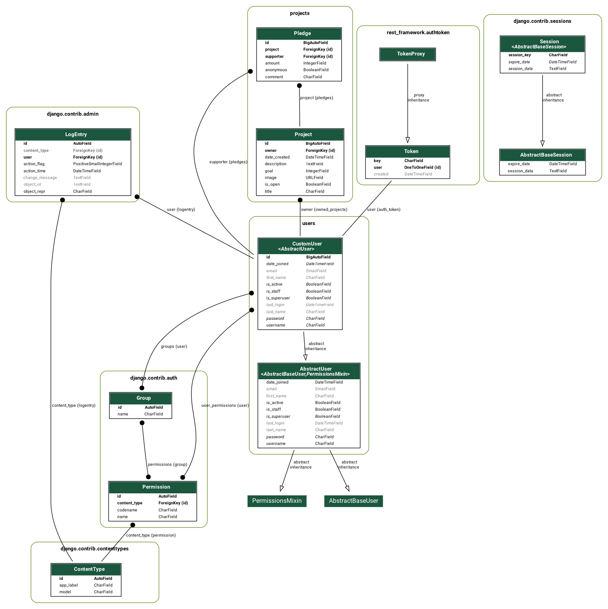
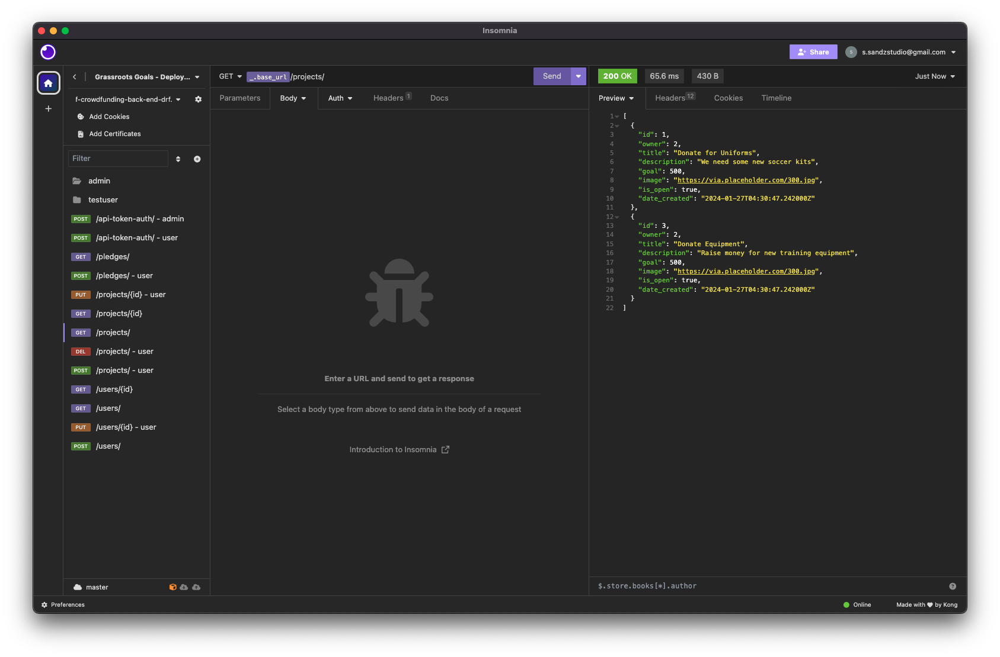
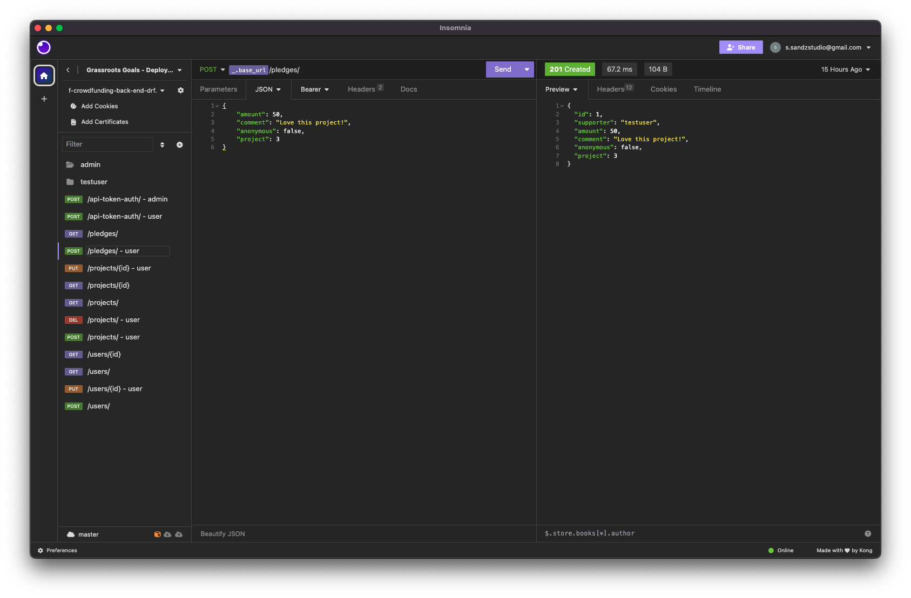
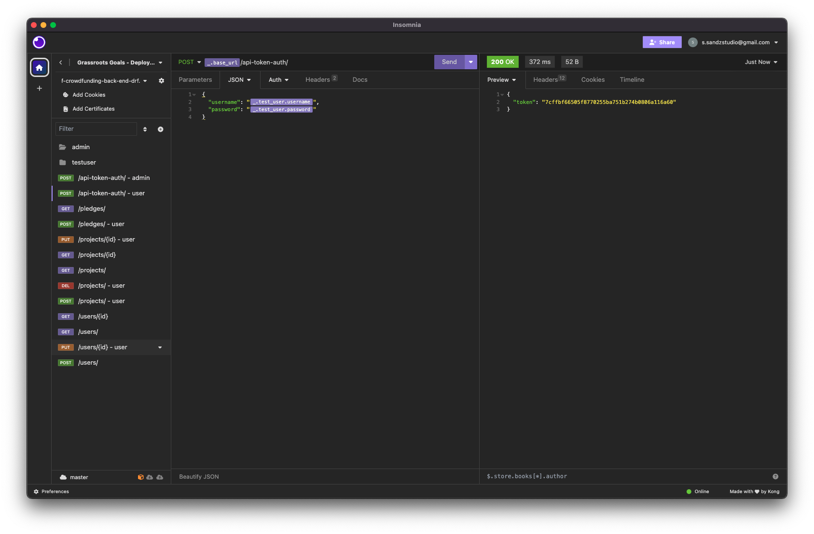

# Crowdfunding Back End
Sandra Lopez

## Planning:
### Grassroots Goals

Deployed site: https://drf-crowdfunding-back-end-drf.fly.dev/projects/

Grassroots Goals is a crowdfunding application designed to support local sports clubs in raising funds for various needs within grassroots soccer. This platform enables clubs to initiate campaigns for scholarships, registration fees, uniforms, equipment, and coaching/training expenses. Through Grassroots Goals, communities can come together to contribute and help foster the growth and development of soccer at the grassroots level.

### Intended Audience/User Stories
1. Local Sports Clubs:
Grassroots soccer clubs looking to secure financial support for their various needs, such as scholarships, registration fees, uniforms, equipment, and coaching/training expenses.

2. Players and Athletes:
Individuals involved in grassroots soccer who may benefit from the financial assistance provided by crowdfunding campaigns on the platform.

3. Parents and Families:
Families of young soccer players who seek support for the costs associated with their children's participation in soccer, including registration fees and equipment.

4. Community Members:
Local community members interested in supporting and contributing to the development of grassroots sports, specifically soccer, within their area.

5. Sponsors and Donors:
Potential sponsors and donors who are passionate about supporting youth sports and may want to contribute to specific campaigns or initiatives on the platform.

6. Coaches and Trainers:
Coaches and trainers involved in grassroots soccer who may benefit from crowdfunding campaigns to secure resources for coaching, training programs, and equipment.

By targeting this diverse audience, the Grassroots Goals app aims to create a supportive and engaged community around grassroots soccer, fostering financial assistance and collaboration among local stakeholders.

### Front End Pages/Functionality
- Index/Home Page
    - Log In/Create Account
    - View Features Projects
    - View total raised for each featured project
- Project Page
    - Project Description
    - Project Image
    - Project Pledges
    - Total Raised

### Create A New User -> Create a new Project
Register a new user
1. Create a collection in your Insomnia
2. Create a new HTTP request - POST
3. URL: https://drf-crowdfunding-back-end-drf.fly.dev/users/
4. Request Body -> JSON. Enter User Account credentials in JSON Format:
    
        {
            "username": "testuser",
            "password": "testuser"
        }
5. Success code 201 - Auth Token response (Enter this token in the AUTH-BEARER Tab for any requests that require authenfification. 
   - Token = [your_token]
   - Prefix = Token)

Create a new project
1. Create a new HTTP request - POST
2. URL: https://drf-crowdfunding-back-end-drf.fly.dev/projects/
3. Request Body -> JSON. Enter Project in JSON Format:

        {
            "title": "title",
            "description": "description",
            "goal": amount,
            "image": "image_URL",
            "is_open": true/false,
            "date_created": "ISO-8601 String"
        }

### API Spec

### DB Schema

### INSOMNIA
Successful GET request

Successful POST request

Successful TOKEN return

### Project Requirements

 - [x] Be separated into two distinct projects: an API built using the Django Rest Framework and a website built using React.
 - [x] Have a cool name, bonus points if it includes a pun and/or missing vowels. See https://namelix.com/ for inspiration. (Bonus Points are meaningless)
 - [x] Have a clear target audience.
 - [x] Have user accounts. A user should have at least the following attributes: 
   - [x] Username
   - [x] Email address
   - [x] Password
 - [x] Ability to create a “project” to be crowdfunded which will include at least the following attributes:
   - [x] Title
   - [x] Owner (a user)
   - [x] Description
   - [x] Image
   - [x] Target amount to fundraise
   - [x] Whether it is currently open to accepting new supporters or not 
   - [x] When the project was created
 - [x] Ability to “pledge” to a project. A pledge should include at least the following attributes:
   - [x] An amount
   - [x] The project the pledge is for
   - [x] The supporter/user (i.e. who created the pledge) 
   - [x] Whether the pledge is anonymous or not
   - [x] A comment to go along with the pledge
 - [x] Implement suitable update/delete functionality, e.g. should a project owner be allowed to update a project description?
 - [x] Implement suitable permissions, e.g. who is allowed to delete a pledge?
 - [x] Return the relevant status codes for both successful and unsuccessful requests to the API.
 - [ ] Handle failed requests gracefully (e.g. you should have a custom 404 page rather than the default error page).
  
 - [x] Use Token Authentication.
 - [ ] Implement responsive design [Front end - REACT]

### Submission

 - [x] A link to the deployed project.
 - [x] A screenshot of Insomnia, demonstrating a successful GET method for any endpoint.
 - [x] A screenshot of Insomnia, demonstrating a successful POST method for any endpoint.
 - [x] A screenshot of Insomnia, demonstrating a token being returned.
 - [x] Step by step instructions for how to register a new user and create a new project (i.e. endpoints and body data).
 - [x] Your refined API specification and Database Schema.